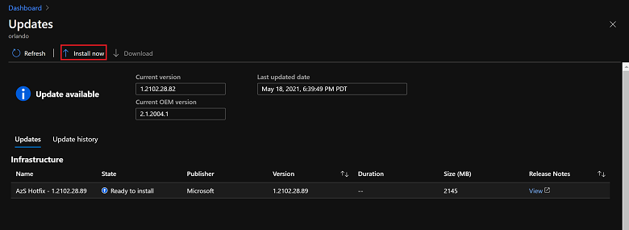
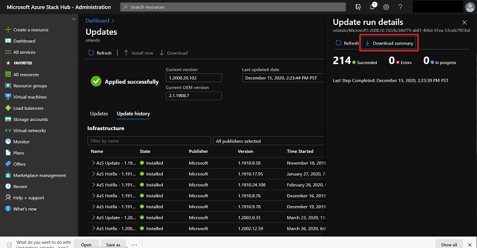
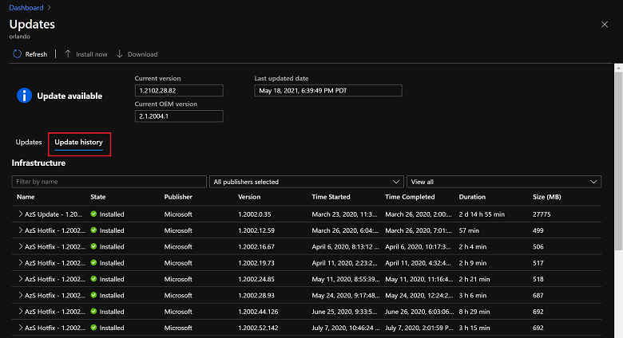

# Install Azure Stack Hub Updates

You can install update packages using the **Update** blade in the Azure Stack Hub administrator portal. This article describes the steps to update, monitor, and troubleshoot the update process. Use the **Update** blade to view update info, install updates, monitor update progress, review update history, and view the current Azure Stack Hub and OEM package version.

You can manage updates from the administrator portal and use the **Updates** section of the dashboard to:

- View important info, such as the current version.
- Install updates and monitor progress.
- Review update history for previously installed updates.
- View the cloud's current OEM package version.

## Determine the current version

You can view the current version of Azure Stack Hub in the **Update** pane. To open:

1. Open the Azure Stack Hub administrator portal.

2. Select **Dashboard**. In the **Update** pane, the current version is listed:

    

## Install updates and monitor progress

> [!IMPORTANT]
> Before applying updates in Azure Stack Hub, ensure you have completed all steps in the [pre-update checklist](release-notes-checklist.md) and have scheduled an appropriate maintenance window for the update type that you are applying.

1. Open the Azure Stack Hub administrator portal.

2. Select **Dashboard**. Select **Update**.

3. Select the available update that you want to install. If you don't have an update marked as **Available**, [prepare the update package](azure-stack-update-prepare-package.md).

4. Select **Install now**.

    

5. You can view high-level status as the update process iterates through various subsystems in Azure Stack Hub. Example subsystems include physical hosts, Service Fabric, infrastructure virtual machines, and services that provide both the admin and user portals. Throughout the update process, the update resource provider reports additional details about the update, such as the number of steps that have succeeded, and the number in progress.

6. Select **Download summary** from the update run details blade to download full logs.

    If you experience an issue while monitoring the update, you can use the [privileged endpoint](./azure-stack-privileged-endpoint.md) to monitor the progress of an Azure Stack Hub update run. You can also use the privileged endpoint to resume a failed update run from the last successful step if the Azure Stack Hub portal becomes unavailable. For instructions, see [Monitor updates in Azure Stack Hub using PowerShell](azure-stack-update-monitor.md).

    

7. When complete, the update resource provider displays a **Succeeded** confirmation to show that the update process has finished, and how long it took. From there, you can view info on all updates, available updates, or installed updates using the filter.

   If the update fails, the **Update** blade reports **Needs attention**. Use the **Download full logs** option to get a high-level status of where the update failed. Azure Stack Hub log collection helps with diagnostics and troubleshooting.

## Review update history

1. Open the administrator portal.

2. Select **Dashboard**, then select **Update**.

3. Select the **Update history** tab.

    

## Next steps

- [Manage updates in Azure Stack Hub overview](./azure-stack-updates.md)  
- [Azure Stack Hub servicing policy](./azure-stack-servicing-policy.md)  
