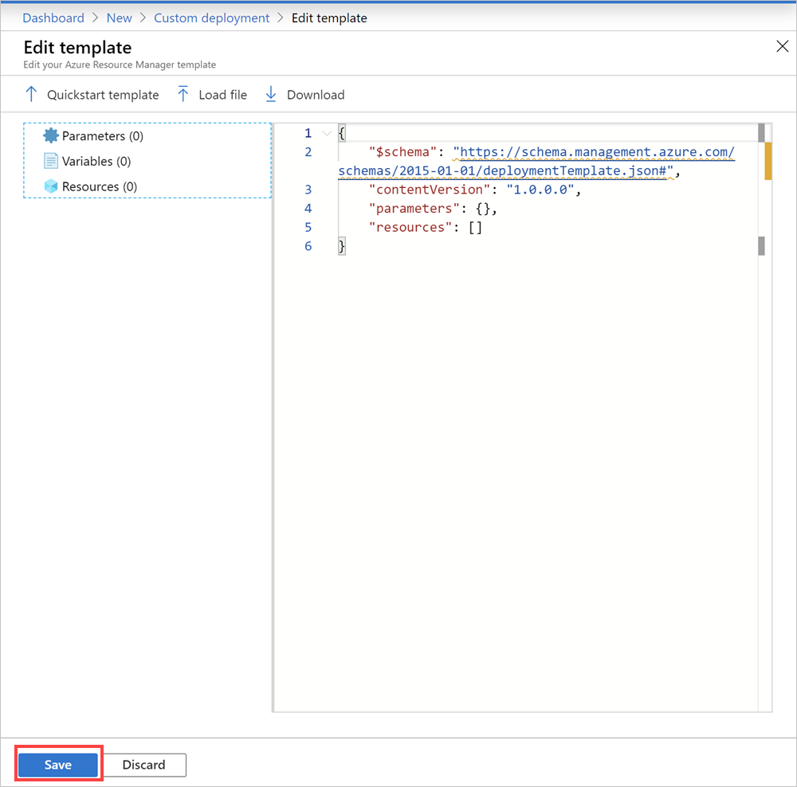
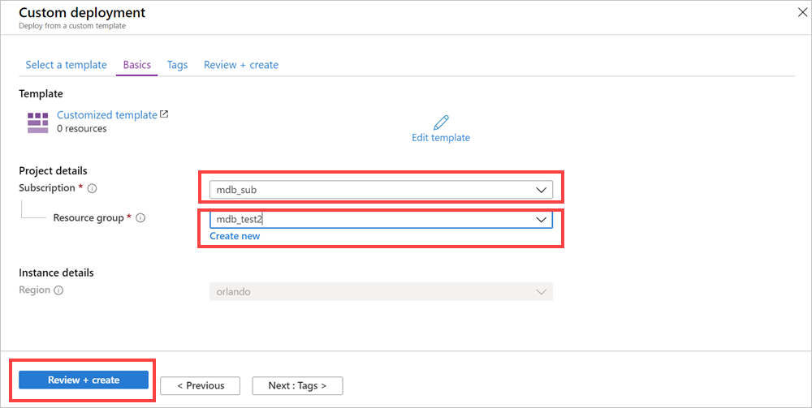
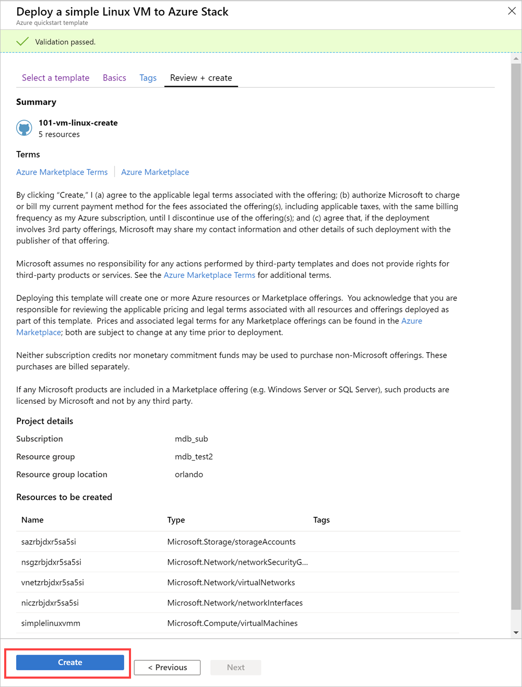

# Deploy a template using the portal in Azure Stack Hub

You can use the Azure Stack Hub user portal to deploy Azure Resource Manager templates to Azure Stack Hub.

## To deploy a template

1. Sign in to the Azure Stack Hub user portal, select **+ Create a resource** > **Custom** > **Template deployment**.

   

2. You can either select **Type to start filter** to choose a GitHub quickstart template, or choose **Build your own template in the editor**.

   

    [**AzureStack-QuickStart-Templates**](https://github.com/Azure/AzureStack-QuickStart-Templates) are created by a member of the Azure Stack Hub community and not by Microsoft. Each  template is licensed to you under a license agreement by its owner, not Microsoft. Microsoft is not responsible for these templates and does not screen for security, compatibility, or performance. Community templates are not supported under any Microsoft support program or service, and are made available *as is* without warranty of any kind.

3. If you selected **Build your own template in the editor**, paste your JSON template code into the code window.

   

    - Select **Quickstart template** to load a community template in the editor.

    - Select **Load file** to load an Azure Resource Manager template from your local machine into the editor.

    - Select **Download** to save the Azure Resource Manager template to your local machine.

    When you are done making changes to your template, select **Save**.

4. Select **Subscription**. Choose the subscription you want to use. Select **Resource group**. You can choose an existing resource group or create a new one, and then select **OK**. And then select **Review + create**.

   

5. Select **Create**.

   

6. A new tile on the dashboard tracks the progress of your template deployment.

   

   You can use Azure Resource Manager templates to deploy and provision all the resources for your application in a single, coordinated operation. You can also redeploy templates to make changes to the resources in a resource group. for more information on using templates with Azure Stack Hub, see [Use Azure Resource Manager templates in Azure Stack Hub](azure-stack-arm-templates.md).

## Next steps

To learn more about deploying templates, see the following article:

- [Deploy templates with PowerShell](azure-stack-deploy-template-powershell.md)
